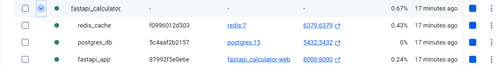
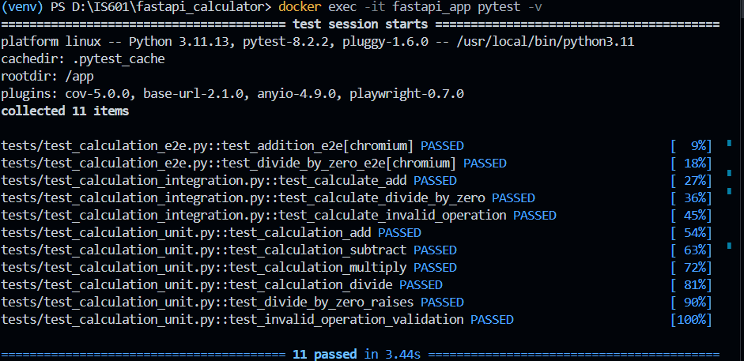
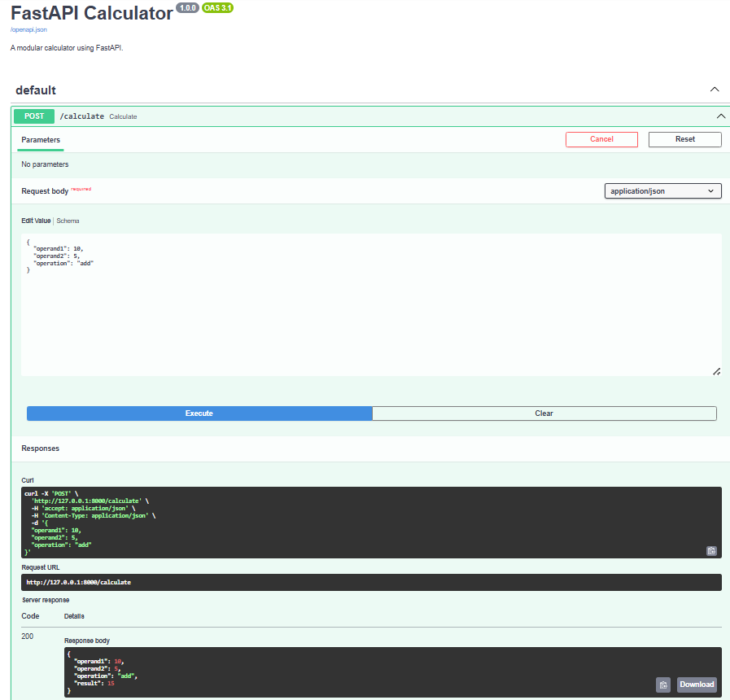
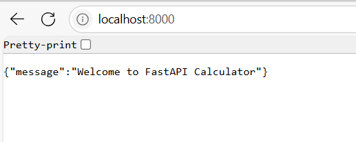
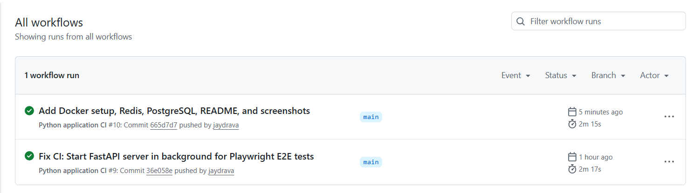

# FastAPI Calculator

A modular calculator API built with FastAPI, Docker, PostgreSQL, and Redis.

---

## Features

- Supports basic arithmetic operations: add, subtract, multiply, divide
- REST API with JSON input/output
- Modular codebase with clear separation of concerns
- Dockerized with multi-container setup (FastAPI app, PostgreSQL, Redis)
- Environment variables managed via `.env` file
- Comprehensive automated tests: unit, integration, end-to-end
- Ready for CI/CD with Docker and GitHub Actions

---

## Project Structure

```bash
fastapi_calculator/
│
├── app/
│ ├── main.py # FastAPI application entrypoint
│ ├── routers/
│ │ └── calculator_route.py # API route definitions
│ ├── schemas/
│ │ └── calculation_schema.py # Request/response models
│ ├── services/
│ │ └── calculation_service.py # Business logic
│ ├── factory/
│ │ └── calculation_factory.py # Factory for creating calculations
│ └── ... # Other app modules (utils, exceptions, etc.)
│
├── tests/ # Unit, integration, and E2E tests
│ ├── test_calculation_unit.py
│ ├── test_calculation_integration.py
│ └── test_calculation_e2e.py
│
├── .env # Environment variables for DB & Redis
├── docker-compose.yml # Multi-container Docker setup
├── Dockerfile # Dockerfile for FastAPI app
├── requirements.txt # Python dependencies
└── README.md # Project documentation

```
## Project Setup & Running

### 1. Clone the repository and navigate to project folder

```bash
git clone <your-repo-url>
cd fastapi_calculator
```
### 2. Create .env file
Create a .env file in the root directory with the following content:
```bash
DATABASE_URL=postgresql://postgres:postgres@db:5432/app_db
REDIS_URL=redis://redis:6379
```
### 3. Build and run the Docker containers
```bash
docker-compose up --build
```
### 4. Access the API
Open your browser or API client (Postman, curl) and visit:
```bash
http://localhost:8000
```
You should see the JSON response:
```bash
{"message":"Welcome to FastAPI Calculator"}
```
# Testing the API Endpoints
Manual Testing with curl (Windows PowerShell)
Run this command in PowerShell to test the /calculate endpoint:
```bash
curl.exe -X POST "http://localhost:8000/calculate" -H "Content-Type: application/json" -d '{\"operand1\":10,\"operand2\":5,\"operation\":\"add\"}'
```
Expected JSON response:
```bash
{
  "operand1": 10.0,
  "operand2": 5.0,
  "operation": "add",
  "result": 15.0
}
```
# Running Automated Tests Inside Docker Container
List running Docker containers to find your app container name:

```bash
docker ps
```
Run tests inside the container (replace fastapi_app with your container’s name):
```bash
docker exec -it fastapi_app pytest -v
```
You should see output showing all tests passing.

# Pushing Docker Image to Docker Hub
Log in to Docker Hub:
```bash
docker login
```
Tag your local image (replace yourusername with your Docker Hub username):
```bash
docker tag fastapi_calculator-web yourusername/fastapi_calculator:latest
```
Push the image to Docker Hub:
```bash
docker push yourusername/fastapi_calculator:latest
```
Verify your image is on Docker Hub by visiting https://hub.docker.com/.

### 5. Screenshots







# Docker Hub link
https://hub.docker.com/repository/docker/jaydrava/fastapi_calculator

# Notes
- Ensure Docker and Docker Compose are installed.
- The .env file must be configured properly for database and Redis connection.
- For running tests, make sure pytest and other dependencies are installed in your Docker  image.
